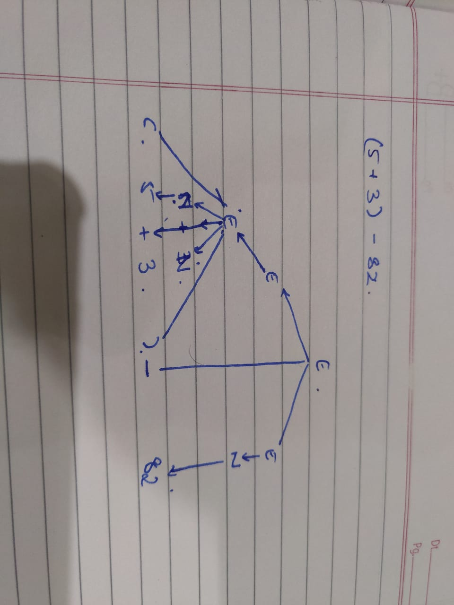

## Continued
G = (V, Σ, R, S)
where -
- V a finite set called the set of variables
- Σ a finite set of characters
- S ∈ V start variables
- R is a set of rules A → string of variables and/or letters from Σ

## Rules
supp. rule A → 0A1
And if w1 = 01A11 ⟹ w2 = 010A111
where w2 is _derived_ from w1.

Also,

w1⟹w2⟹w3⟹w4⟹...⟹wn

Then w1 =*⟹ wn

Given a CFG G(= (V,Σ,R,S)), then the language **generated** by it is LG = { w | w∈Σ* and S =*⟹ w }

### Example
In the previous case of the Grammar of arithmetic over add and sub,
- Σ was {0...9, (, ), +, -}
- V was {E, N}
- R was
  - E → E+E | E-E | (E) | N
  - N → 0 | ... | 9 | NN
- S = E

## Parse Tree

## Stack
FILO - First in Last out. You _push_ into the stack, but you **must** _pop_ out the **last** element only.

## Parse to check if Expr.

Let St be a St.

1. Push E to St
2. Pop
