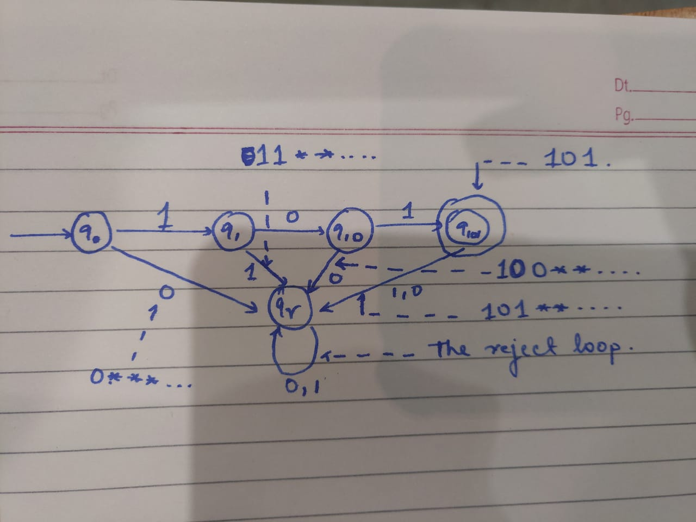

## Finite State Automaton ##
M = (Q, Σ, δ, q0, f)
There is a set of states Q which M manipulates by δ over Σ and the string is accepted if it lies in f ⊂ Q, starting from q0.

q0 ∈ Q, f ⊂ Q

> M always reads the entire input.

### Accepting a string ###

Given a string, S = c0,c1...cn, M accepts S iff ∃ r0, r1, ... rn+1 ∈ Q, st
1. r0 = q0
2. ri + 1 = δ(ri, ci)
3. rn+1 ∈ f

A language is recognized by M, iff L = \{s \| M accepts s\}.

### Example ###
1. Define a Finite State Automaton that recognizes the language L = 101, Σ = \{0,1\}. Look at Fig 1 for implementation.

**Side note**

FSAs can be _implemented_ in more than one ways. Is there a _minimal_ implementation?

2. Define a Finite State Automaton that recognizes the language L = \{s \| s has equal 0s and 1s\}, Σ = \{0,1\}

[Pigeonhole Principle](https://en.wikipedia.org/wiki/Pigeonhole_principle)

r0 → r1 → ... → ri → ... → rn

Continued in next class...
